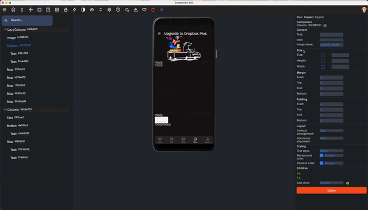

# [Component Box](https://componentbox.io) &middot; [](https://github.com/dropbox/componentbox/blob/main/LICENSE.txt) [](https://componentbox.io/docs/how-to-contribute)

A Kotlin multiplatform library for building dynamic server-driven UI.

- **Material Component-Based**
- **Interoperable**
- **Dynamic**
- **What You See Is What You Get**



[Learn how to use Component Box in your project](https://componentbox.io/docs/).

## Installation

```kotlin
implementation("com.dropbox.componentbox:componentbox:0.0.1-alpha")
```

## Documentation

You can find Component Box documentation [on the website](https://componentbox.io).

Check out the [Getting Started](https://componentbox.io/docs/) page for a quick overview.

## Examples

```kotlin
class Screen(
    private val componentBoxUrl: String,
    private val presenter: ComponentBoxPresenter,
    private val context: Context
): ComponentBoxFragment()
```

```kotlin
@Composable
fun Screen() {
    val zipline = ComponentBoxZipline(getZiplineUrl(), getScript())
    val presenter = ComponentBoxPresenter(zipline)

    ComponentBoxView(
        componentBoxUrl = getComponentBoxUrl(),
        presenter = presenter,
        context = getContext(),
        Loading = { Loading() },
        Fallback = { Fallback() }
    )
}
```

## Contributing

Evolving Component Box is the main reason we published this repository. PRs are welcome!

### [Contributing Guide](https://componentbox.io)

Read our [contributing guide](https://componentbox.io) to learn about our development process, how to propose fixes and enhancements, and how to build and test your changes.

### Good First Issues

Start with one of our [good first issues](https://github.com/dropbox/componentbox/labels/good%20first%20issue)!

### License

```text
Copyright (c) 2022 Dropbox, Inc.

Licensed under the Apache License, Version 2.0 (the "License");
you may not use this file except in compliance with the License.
You may obtain a copy of the License at

    http://www.apache.org/licenses/LICENSE-2.0

Unless required by applicable law or agreed to in writing, software
distributed under the License is distributed on an "AS IS" BASIS,
WITHOUT WARRANTIES OR CONDITIONS OF ANY KIND, either express or implied.
See the License for the specific language governing permissions and
limitations under the License.
```
